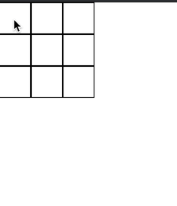

### COMEÇANDO OS EXERCÍCIOS

Abaixo temos um _gif_ do comportamento da aplicação até a parte 1 do exercício 3:

#### Exercício 1

Escreva os testes para as configurações iniciais do jogo:

- Campos vazios;
- Sem mensagem de Fim de jogo;
- 9 Casas renderizadas.

Fique livre para adicionar novos testes.

---

#### Exercício 2

Agora, além de realizar alguns testes, será necessário implementar algumas funcionalidades.
O arquivo TicTacToe.js possuí algumas informações de como o jogo deve funcionar.
  - Dois jogadores jogam o jogo;
  - A cada clique em uma casa o jogador deve ser mudado;
  - Cada jogador deverá possuir uma marcação (as imagens que estão no repositório, x.png, o.svg);
  - Ao clicar na casa escolhida, a casa deve ser modificada para possuir a marcação do jogador, X ou O;
  - Ao clicar em uma casa já marcada, nada deve acontecer;
  - AS casas marcadas não podem ser modificadas;

Teste o comportamento de cada casa, alguns exemplos:

- O símbolo mudar quando clica em uma e depois em outra, mostrando a troca do jogador;
- Casa não pode ser mudada depois de clicada em por algum jogador;

Caso tenha dúvida volte no conteúdo ou olhe na documentação, lembre que abordamos apenas algumas querys, tem outras que podem ser utilizadas.

---

#### Exercício 3

Agora você fará a funcionalidade de acordo com o teste já criado para ela. A funcionalidade deve ser criada no arquivo TicTacToe.js, boa parte dele já está criado, fique atento com as instruções passadas.

Precisamos saber quando que o jogo acaba! Os testes já foram implementados, mas se roda-los verá que nenhum passa. Essa funcionalidade ainda não está pronta e precisa ser criada.

Crie a aplicação observando os teste, eles te guiarão.

Bônus - Nossos testes não cobrem caso de empate ou quem foi o ganhador.

- Crie uma mensagem para ver quem é o vencedor ou quando acontecer o empate.
- Crie os teste para essa nova funcionalidade.
- Adicione um botão para recomeçar o jogo. Crie os teste para ele.
